# CityWasteCollection

Simple city waste collection system built using Python.

- Used NetworkX and MatPlotLib to simulate a neighbourhood consisting of nodes (intersections) and paths (roads).
- Uses gRPC for communications between the server and the clients (waste removal trucks
- Uses RabbitMQ to provide residents with updates.
  - Residents can choose to subscribe to a specific section of the street or enable all notifications.

## Demonstration:

### Resulting NetwrokX directed graph given a list of directed edges:

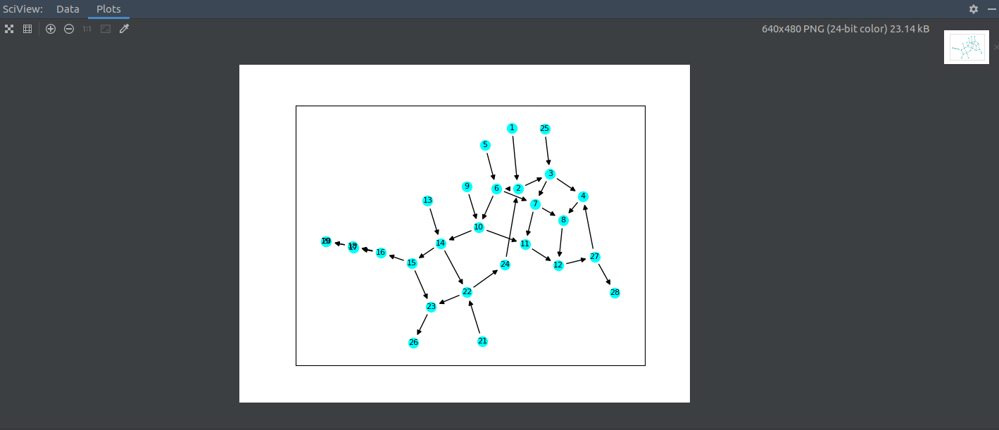

### Output after starting the server (with analyzed paths):

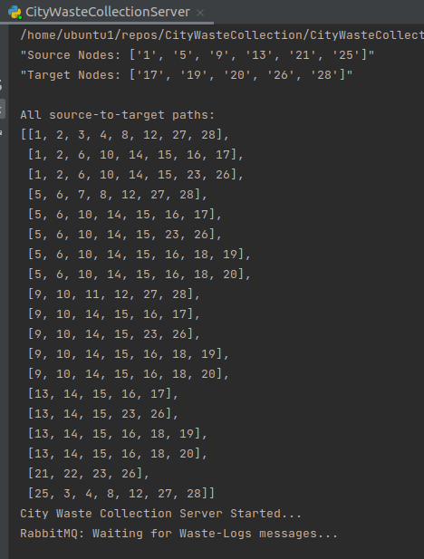

### Two residential clients subscribed to the Notifier exchange. Left client is subscribed to all notifications while right client is subscribed to edge [4,8]:

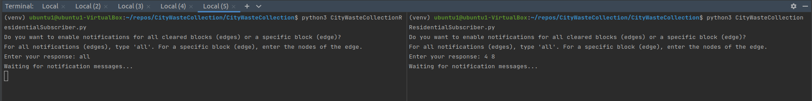

### Waste collection vehicle (client) collecting waste along edges (node-pairs).

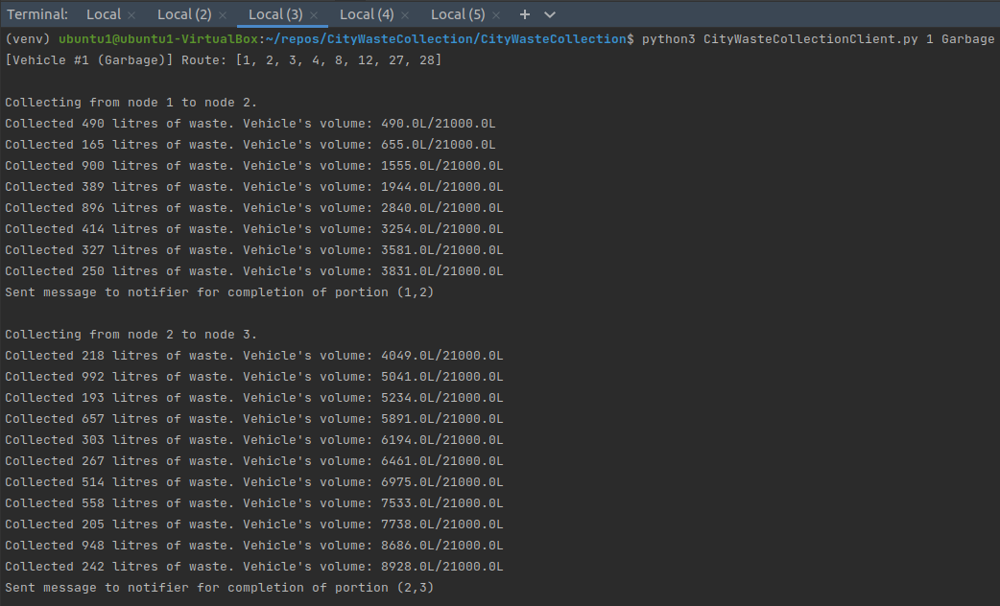

### Maximum capacity is reached and vehicle makes a remote procedure call requesting another vehicle to continue the route.

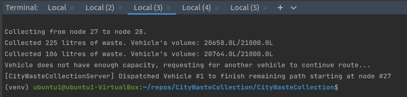

### Server output showing deployed vehicles and their routes.

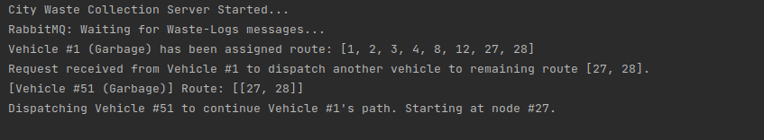

### Resulting notifications sent to residential clients (subscribers):

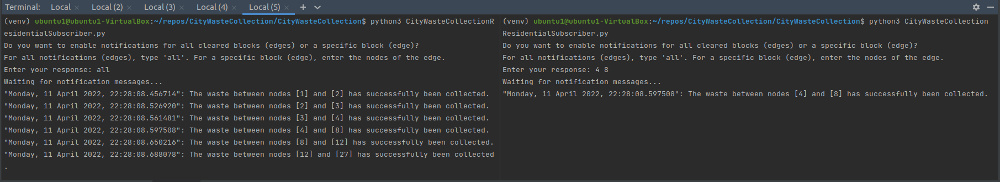

### Log file of waste collection created using JSON dumps:

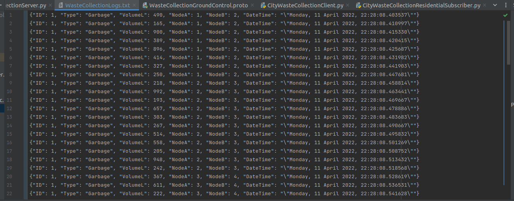

### RabbitMQ Statistics, Exchanges, and Queues:

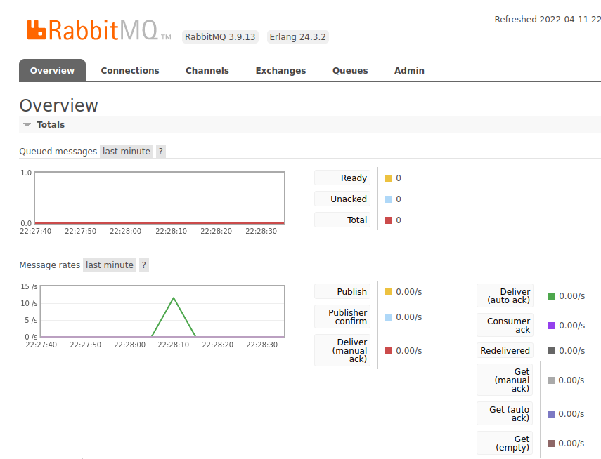
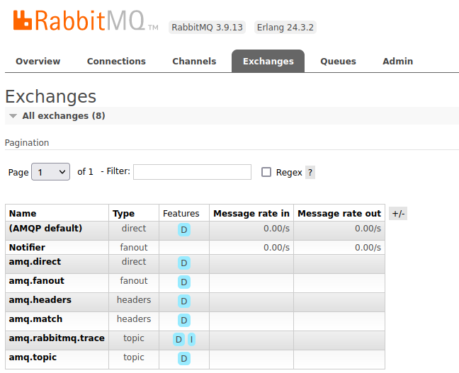
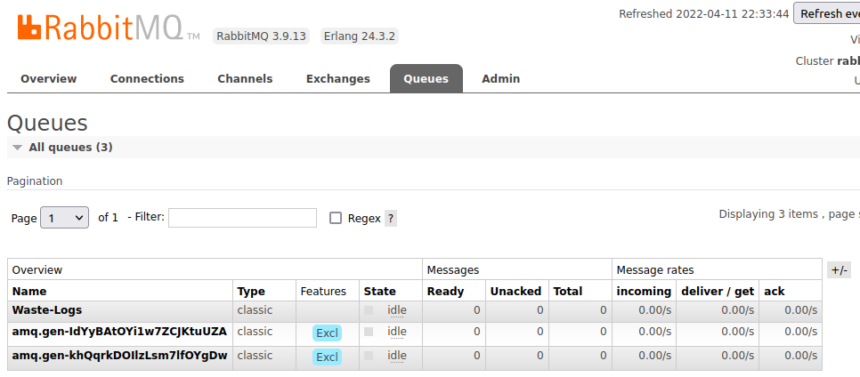

# Usage Instructions

To run the programs, follow the instructions below:

### Run Docker/RabbitMQ-Server container:

> `sudo /etc/init.d/rabbitmq-server stop`
>
> `sudo chmod 666 /var/run/docker.sock`
>
> `docker run -it --rm --name mqserver -p 5672:5672 -p 15672:15672 rabbitmq:3.9-management`

Access management interface at: `http://localhost:15672/`

- Username: `guest`
- Password: `guest`

### Run CityWasteCollectionServer.py

#### Method 1:

- Press the `run button` in PyCharm on the `CityWasteCollectionServer.py` file.
- This will also display the Directed Graph which is generated based on the directed edges provided in maps/NodeMap.txt

#### Method 2:

- Open a `new terminal` in PyCharm and run:

> `python3 CityWasteCollectionServer.py`

### Run CityWasteCollectionResidentialSubscriber.py

- This file subscribes to the RabbitMQ 'Notifier' exchange which operates in a 'fanout' style.
- Multiple users can subscribe to the exchange to receive notifications about waste collection.
- After running the program, the user has the option to receive all notifications or notifications for a specific edge (node-pair).

### Open a new terminal in Pycharm and run:

> `python3 CityWasteCollectionResidentialSubscriber.py`

When the program prompts for input:

- A user can type 'all' to receive all notifications.
- A user can type two integers representing a node-pair (edge) of the map, separated by a space.
- Example: '4 8' for the edge [4,8]

### Run the CityWasteCollectionClient program:

Open a new terminal in PyCharm and run:

> `python3 CityWasteCollectionClient.py <VEHICLE_ID> <VEHICLE_TYPE>`

`VEHICLE_ID` is an integer representing the waste collection vehicle's ID.  
`VEHICLE_TYPE` specifies the type of collection; waste, recycling, etc...

#### Example:

> `python3 CityWasteCollectionClient.py 1 Garbage`
